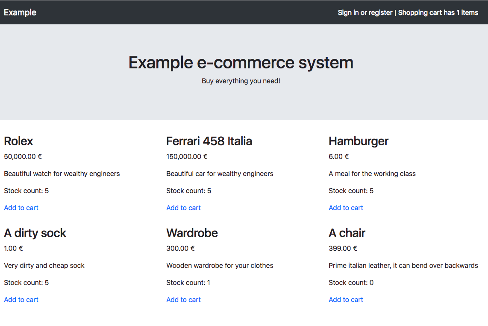
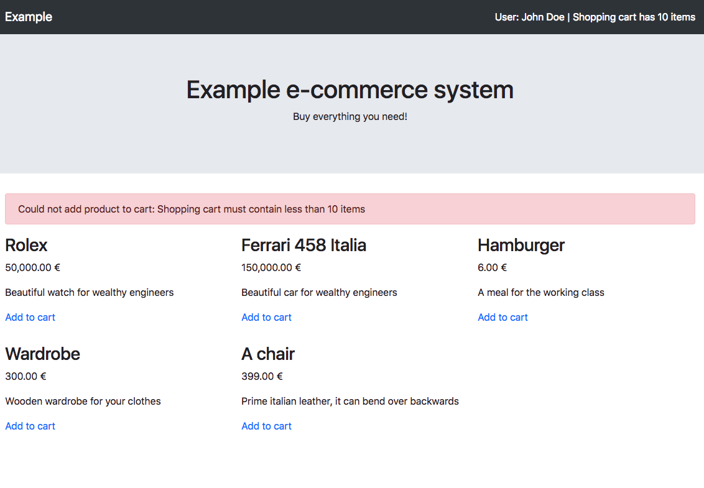
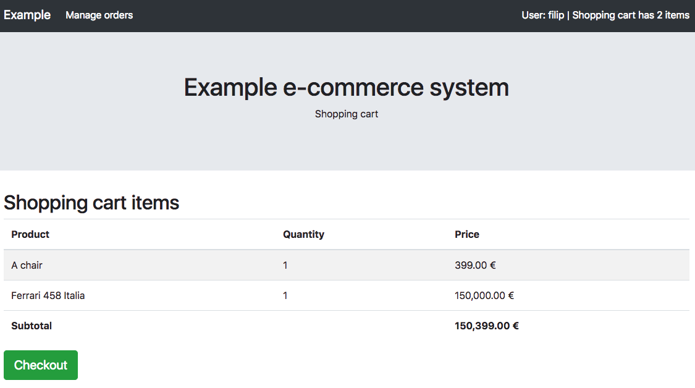
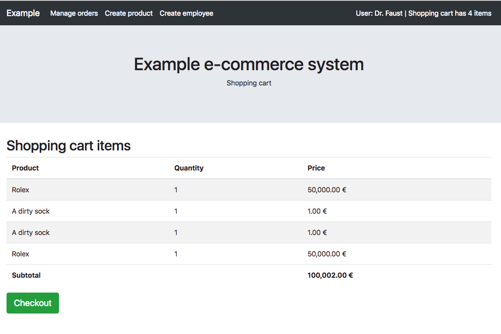
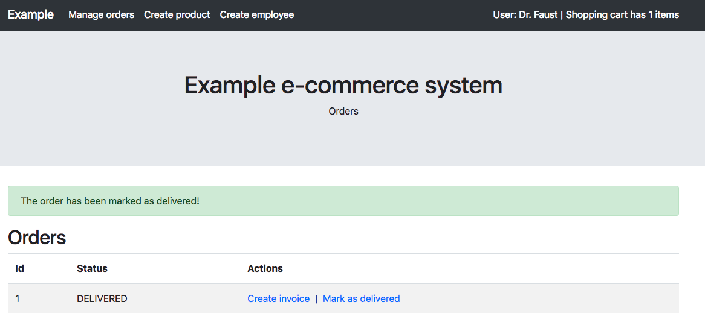
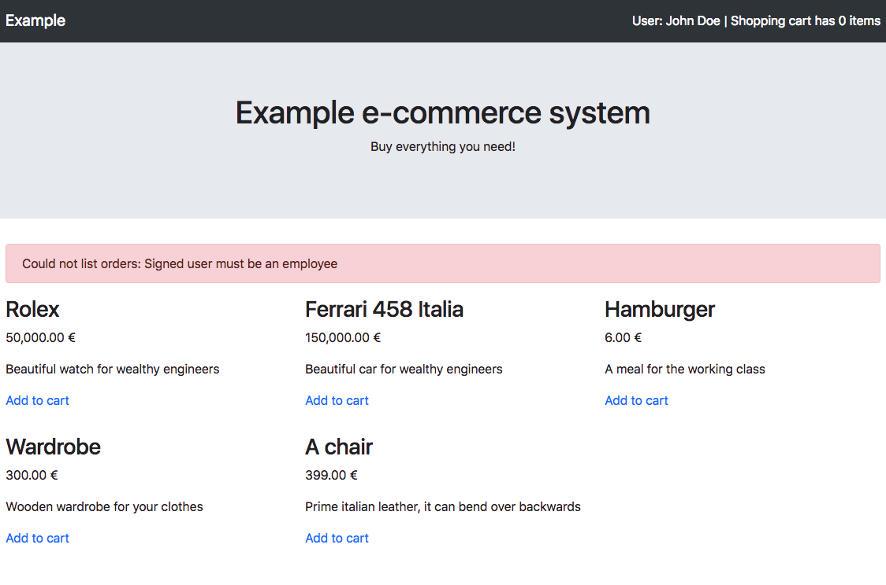

# Example system screenshots

## Homepage

Products are listed here.
Products with attribute `hidden=true` are not listed due
to business rule post-condition.

## Add product to shopping cart

## Adding product to shopping cart failed

Due to business rule precondition requiring the shopping cart has at most 10 items.

## Shopping cart overview

## Shopping cart checkout

## Order created

Order has been successfuly created after checking out.

## List all orders

This action requires to be signed in as an Employee or an Administrator.

## Listing all orders failed

Due to business rule precondition requiring the user to be an Employee or an Administrator.

